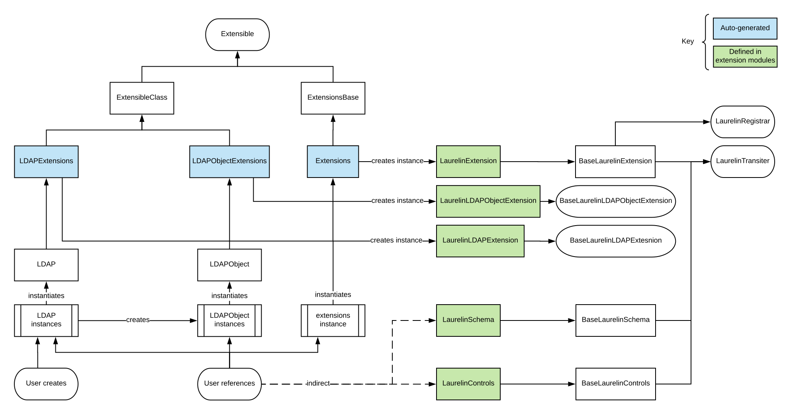

Creating Extensions
===================

.. contents::
   :local:

The most important thing to note about "extensions" is that they are not necessarily LDAP extensions. In laurelin, they
are simply a module that does any combination of: defining new schema elements, defining new controls, or defining new
methods to be attached to :class:`.LDAP` or :class:`.LDAPObject`.

Extension System
----------------

Extensions live in any importable module or package. They must at minimum define a class called ``LaurelinExtension`` as
follows::

    from laurelin.ldap import BaseLaurelinExtension

    class LaurelinExtension(BaseLaurelinExtension):
        NAME = 'some_name'

You'll notice the :class:`.BaseLaurelinExtension` here - this is required. It is one of many weapons at your disposal.

Extension Classes
^^^^^^^^^^^^^^^^^

All of these share the same common end-user interface of being exposed as either a property or dynamic attribute on some
other instance that the user typically will already use normally. Which class they are attached to depends on the name
and base class of the defined extension class. Whether they are accessible as a property (with IDE auto-complete
support) or a dynamic attribute depends on how the extension is loaded and defined (more below), but the user API is
unchanged either way.

``class LaurelinExtension(`` :class:`.BaseLaurelinExtension` ``):``
   As described above, this is where you define the name of the property or dynamic attribute where all instances of
   these extension classes can be accessed. One instance of this class is created per Python interpreter when the
   extesion is first added or used (more on this later) and it is accessible to users at
   ``laurelin.ldap.extensions.<NAME>``.

``class LaurelinLDAPExtension(`` :class:`.BaseLaurelinLDAPExtension` ``):``
   This is where you can bind methods, attributes, etc. that will be attached to :class:`.LDAP` by way of property or
   dynamic attribute with name corresponding to your ``LaurelinExtension.NAME``. You can access the parent
   :class:`.LDAP` instance at ``self.parent``. Up to one instance is created per :class:`.LDAP` instance when the
   property or dynamic attribute is first accessed on a particular instance.

``class LaurelinLDAPObjectExtension(`` :class:`.BaseLaurelinLDAPObjectExtension` ``):``
   This is where you can bind methods, attributes, etc. that will be attached to :class:`.LDAPObject` by way of property
   or dynamic attribute with name corresponding to your ``LaurelinExtension.NAME``. You can access the parent
   :class:`.LDAPObject` instance at ``self.parent``. Up to once instance is created per :class:`.LDAPObject` instance
   when the property or dynamic attribute is first accessed on a particular instance.

Schema and Controls Classes
^^^^^^^^^^^^^^^^^^^^^^^^^^^

These two simply attempt to register all public attributes defined within them as schema elements or controls. More
about actually defining these below, the class signatures should look like this, though:

``class LaurelinSchema(`` :class:`.BaseLaurelinSchema` ``):``
   Define all :class:`.SyntaxRule` and :class:`.EqualityMatchingRule` classes as local classes within this class.
   Directly instantiate :class:`.ObjectClass` and :class:`.AttributeType` with standard spec strings and assign them
   to class attributes.

``class LaurelinControls(`` :class:`.BaseLaurelinControls` ``):``
   Define all :class:`.Control` classes as local classes within this class.

Also note that if your schema depends on the base schema, you must require it at the top of your extension like so::

    from laurelin.ldap import extensions

    extensions.base_schema.require()

Depending on Extensions
^^^^^^^^^^^^^^^^^^^^^^^

Extension authors may want to duplicate and tailor some or all of this information in their own documentation for users.

There are two ways laurelin can be made aware of extensions:

1. By passing a module name string to :func:`.add_extension`. This will cause the extension class instances to be
   made available as dynamic attributes.
2. By being defined in :attr:`.Extensible.AVAILABLE_EXTENSIONS`. A script will automatically generate properties that
   are inherited by the appropriate parent class (:class:`.LDAP` or :class:`.LDAPObject`). This has the benefit that
   IDEs can auto-complete extension instances if the extension is installed (tested with PyCharm). Also defined with
   your extension is the string module name, so your users do not need to copy this themselves, as well as the pip
   package name, which will be included in the exception if users attempt to use your extension when its not installed.

There are clear pros and cons to each approach, and extension authors are welcome to instruct users to take either
approach. #1 may be preferred during development, or if you do not intend to publish your extension publicly.

One caveat to #2 above if you define schema or controls, is your users will need to explicitly require your extension
like so::

    from laurelin.ldap import extensions

    extensions.<NAME>.require()

This happens implicitly in the following situations:

* When ``add_extension()`` is called, as in #1 above
* When the user accesses your ``<NAME>`` extension property/attribute on :class:`.LDAP` or :class:`.LDAPObject`, if you
  defined any extensions to those classes
* Technically happens implicitly when ``extensions.<NAME>`` is accessed, so if you define any other user-exposed
  attributes on your ``LaurelinExtension`` class that all users *must* access, you can instruct them to use that
  instead.

So if you **require** any of these of your users by way of your own documentation, you can also have them skip the
explicit ``require()`` call.

Regardless of whether your extension is added or defined, your users will need to explicitly add the dependency to their
own package. Laurelin will *never* depend on an extension module, and only built-in extensions are guarnateed to be
available.

Publishing Extensions
^^^^^^^^^^^^^^^^^^^^^

If you are planning on defining any standard LDAP extensions, schema, or controls, I suggest packaging your module under
``laurelin.extensions``, which is a
`namespace package <https://setuptools.readthedocs.io/en/latest/setuptools.html#namespace-packages>`_. This allows an
exceedingly simple and easy path to eventual merging in as a built-in extension. You are welcome to package under
any importable module, though.

If you choose to instruct your users to add your extension, please be sure to write clear and accessible documentation
for them.

If you choose to define your extension, please submit a pull request on GitHub. You should include ONLY a ~5 line
addition to :attr:`.Extensible.AVAILABLE_EXTENSIONS`. The dict key should match your ``LaurelinExtension.NAME``.
The keys in the sub-dictionary should be pretty self-explanatory. Below is a contrived example patch::

    diff --git a/laurelin/ldap/extensible/base.py b/laurelin/ldap/extensible/base.py
    index 593e64b..bd7b233 100644
    --- a/laurelin/ldap/extensible/base.py
    +++ b/laurelin/ldap/extensible/base.py
    @@ -132,6 +132,11 @@ class Extensible(object):
                 'pip_package': None,  # built-in
                 'docstring': 'Built-in extension defining standard paged results control for search'
             },
    +        'some_ext': {
    +            'module': 'your.extension.module',
    +            'pip_package': 'laurelin-some-ext',
    +            'docstring': 'A contrived example laurelin extension'
    +        },
         }

         ADDITIONAL_EXTENSIONS = {}

Please keep your docstrings short. They will be rendered in laurelin's documentation. You may include a Sphinx-formatted
shortlink to your own docs.

If you have any questions, problems, or concerns, please open an issue on GitHub.

LDAP Extensions
---------------

When defining an actual LDAP extension with an OID and requiring server support, you'll create the laurelin extension as
shown above, but you'll be calling the :meth:`LDAP.send_extended_request` method from your extension methods within
your ``LaurelinLDAPExtension`` or ``LaurelinLDAPObjectExtension``.

.. automethod:: laurelin.ldap.LDAP.send_extended_request
   :noindex:

As you can see, this accepts the OID of the LDAP extension and an optional request value. You can also pass control
keywords, and the ``require_success`` keyword, which will automatically check for success on the final extendedResponse
message (and raise an :exc:`.LDAPError` on failure).

If your LDAP extension expects intermediateResponse messages, you can iterate the return from
:meth:`LDAP.send_extended_request`. You can also call :meth:`.ExtendedResponseHandle.recv_response` to get only one
message at a time (preferred to iteration if you only expect the one extendedResponse message).

The built-in :meth:`.LDAP.who_am_i` method is an excellent example of a simple LDAP extension::

   from laurelin.ldap import LDAP
   from laurelin.ldap.protoutils import get_string_component

   def who_am_i(self):
        handle = self.send_extended_request(LDAP.OID_WHOAMI, require_success=True, **ctrl_kwds)
        xr, res_ctrls = handle.recv_response()
        return get_string_component(xr, 'responseValue')

As a laurelin extension this might look like::

    from laurelin.ldap import BaseLaurelinLDAPExtension

    # ...

    class LaurelinLDAPExtension(BaseLaurelinLDAPExtension):
        def who_am_i(self):
            handle = self.parent.send_extended_request(...)
            # ...

Note the use of ``self.parent`` to access :meth:`.LDAP.send_extended_request`.

Controls
--------

Extensions may wish to define controls for use on existing methods. You will need to define one or more
:class:`.Control` classes, see :ref:`defining-controls` for more information about this. The important part for the
purposes of this document is where to place those class definitions in your extension module.

You must define a subclass of :class:`.BaseLaurelinControls` with :class:`.Control` subclasses defined within that. For
example::

    from laurelin.ldap import BaseLaurelinExtension, BaseLaurelinControls, Control

    class LaurelinExtension(BaseLaurelinExtension):
        NAME = 'your_name'

    class LaurelinControls(BaseLaurelinControls):
        class YourControl(Control):
            method = ('search',)
            keyword = 'some_kwd'
            REQUEST_OID = '1.2.3.4'

Schema
------

Extensions may be associated with a set of new schema elements, including object classes, attribute types, matching
rules, and syntax rules. Once defined, these will get used automatically by other parts of laurelin, including the
:class:`.SchemaValidator`, and for comparing items in attribute value lists within an :class:`.LDAPObject`.

Like controls, all extension schema elements must be defined as attributes on a subclass of
:class:`.BaseLaurelinSchema`.

If your schema depends on the laurelin built-in base schema, you must explicitly call
``laurelin.ldap.extensions.base_schema.require()`` near the top of your extension module.

Below is a simple example of defining a new object class depending on the base schema::

    from laurelin.ldap import BaseLaurelinExtension, BaseLaurelinControls, ObjectClass, extensions

    extensions.base_schema.require()

    class LaurelinExtension(BaseLaurelinExtension):
        NAME = 'your_name'

    class LaurelinSchema(BaseLaurelinSchema):
        MY_COMPANY_USER = ObjectClass('''
        ( 1.2.3.4 NAME 'myCompanyUser' SUP inetOrgPerson STRUCTURAL
          MUST ( companyAttribute $ anotherAttribute )
          MAY description
        ''')

The superclass of ``inetOrgPerson`` makes this example require the base schema. All schema instance elements must be
defined as class attributes in this manner (for object classes and attribute types), and all class elements must be
defined below the ``LaurelinSchema`` class (for syntax rules and matching rules).

Object Classes and Attribute Types
^^^^^^^^^^^^^^^^^^^^^^^^^^^^^^^^^^

Creating object classes and attribute types is very simple. Just take the standard LDAP specification and pass it to the
appropriate class constructor. Examples from the netgroups extension::

   from laurelin.ldap.objectclass import ObjectClass
   from laurelin.ldap.attributetype import AttributeType

    ObjectClass('''
    ( 1.3.6.1.1.1.2.8 NAME 'nisNetgroup' SUP top STRUCTURAL
      MUST cn
      MAY ( nisNetgroupTriple $ memberNisNetgroup $ description ) )
    ''')

    AttributeType('''
    ( 1.3.6.1.1.1.1.14 NAME 'nisNetgroupTriple'
      DESC 'Netgroup triple'
      EQUALITY caseExactMatch
      SYNTAX 1.3.6.1.1.1.0.0 )
    ''')

Matching Rules
^^^^^^^^^^^^^^

Defining matching rules takes a little more effort. Matching rules must subclass :class:`.EqualityMatchingRule`.
Required class attributes include:

* ``OID`` - the numeric OID of this rule. Note that this does not need to be IANA-registered to work in laurelin, but it
  still must be globally unique.
* ``NAME`` - the name of the rule. Must also be globally unique. This is usually how matching rules are referenced in
  attribute type specs (see ``caseExactMatch`` in above example).
* ``SYNTAX`` - the numeric OID of the syntax rule that assertion values must match.

Matching rule classes may also optionally define the following attribute:

* ``prep_methods`` - a sequence of callables that will be used to prepare both the attribute value and assertion value
  for comparison. These will typically be defined in :mod:`laurelin.ldap.rfc4518`. The initial attribute/assertion value
  will be passed into the first item in the sequence, and the return from each is passed into the next item.

If you prefer, you can also override the :meth:`.MatchingRule.prepare` method on your matching rule class.

You may also wish to override :meth:`.EqualityMatchingRule.do_match`. This is passed the two prepared values and must
return a boolean. Overriding :meth:`.MatchingRule.match` *is not recommended*.

Below is an example matching rule from :mod:`laurelin.extensions.base_schema`::

   from laurelin.ldap.rules import EqualityMatchingRule
   from laurelin.ldap import rfc4518

    class numericStringMatch(EqualityMatchingRule):
        OID = '2.5.13.8'
        NAME = 'numericStringMatch'
        SYNTAX = '1.3.6.1.4.1.1466.115.121.1.36'
        prep_methods = (
            rfc4518.Transcode,
            rfc4518.Map.characters,
            rfc4518.Normalize,
            rfc4518.Prohibit,
            rfc4518.Insignificant.numeric_string,
        )

Syntax Rules
^^^^^^^^^^^^

Syntax rules must subclass :class:`.SyntaxRule`, although in almost all cases you can use :class:`.RegexSyntaxRule`. If
you do not use a regular expression, you must override :meth:`.SyntaxRule.validate`, which receives a single string
argument, and must raise :exc:`.InvalidSyntaxError` when it is incorrect.

In all cases, you must define the following attributes on your syntax rule class:

* ``OID`` - the numeric OID of the rule. As with matching rules, there is no requirement that this is IANA-registered,
  but it must be globally unique.
* ``DESC`` - a brief description of the rule. This is mainly used in exception messages.

Regex syntax rules must also define:

* ``regex`` - the regular expression.

Below are examples from :mod:`laurelin.ldap.schema`::

   from laurelin.ldap.rules import SyntaxRule, RegexSyntaxRule
   from laurelin.ldap.exceptions import InvalidSyntaxError
   import six

    class DirectoryString(SyntaxRule):
        OID = '1.3.6.1.4.1.1466.115.121.1.15'
        DESC = 'Directory String'

        def validate(self, s):
            if not isinstance(s, six.string_types) or (len(s) == 0):
                raise InvalidSyntaxError('Not a valid {0}'.format(self.DESC))

    class Integer(RegexSyntaxRule):
        OID = '1.3.6.1.4.1.1466.115.121.1.27'
        DESC = 'INTEGER'
        regex = r'^-?[1-9][0-9]*$'

SchemaValidator
^^^^^^^^^^^^^^^

Laurelin ships with :class:`.SchemaValidator` which, when applied to a connection, automatically checks write operations
for schema validity *before* sending the request to the server. This includes any schema you define in your extensions.
Users can enable this like so::

      from laurelin.ldap import LDAP
      from laurelin.ldap.schema import SchemaValidator

      with LDAP('ldaps://dir.example.org', validators=[SchemaValidator]) as ldap:
         # do stuff

You can also define your own validators, see below.

Validators
----------

Validators must subclass :class:`.Validator`. The public interface includes :meth:`.Validator.validate_object` and
:meth:`.Validator.validate_modify`. You will usually just want to override these, however they do include a default
implementation which checks all attributes using the abstract :meth:`.Validator._validate_attribute`. Check method docs
for more information about how to define these.

When defining validators in your extension, you can ensure your users don't need to import the module again by attaching
the class to your ``LaurelinExtension`` class like so::

   from laurelin.ldap import BaseLaurelinExtension, Validator

   class LaurelinExtension(BaseLaurelinExtension):
      NAME = 'my_ext'

      class MyValidator(Validator):
         # ...
         pass

Users can then access it like so::

   from laurelin.ldap import LDAP, extensions

   with LDAP('ldaps://dir.example.org', validators=[extensions.my_ext.MyValidator]) as ldap:
      # do stuff

Class Diagram
-------------

The extension subsystem has several interconnecting classes. Blue are auto-generated classes, and green are defined in
extension modules. Unlabeled arrows indicate class inheritance or are self-explanatory.

